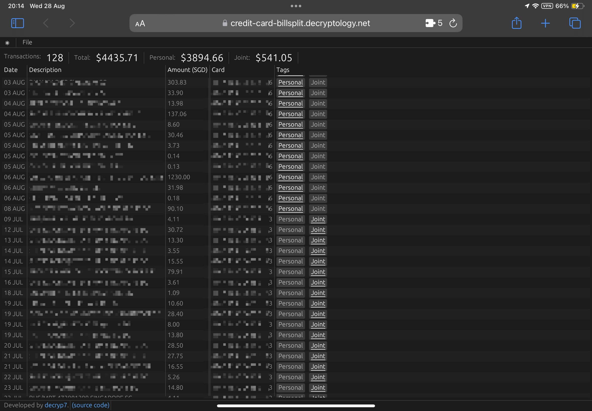

### Citibank Credit Card Bill Splitter
A webassembly application to split transactions into personal and joint transactions.
I use it every month to calculate how much to deduct from personal bank account and joint bank account.

PDF statement is parsed using pdfium-render locally and rendered using egui.
Data is saved locally in browser local storage ONLY, it does not go anywhere else.

Developed in rust with [egui](https://github.com/emilk/egui) and [pdfium-render](https://github.com/ajrcarey/pdfium-render).

### Screenshots
 
